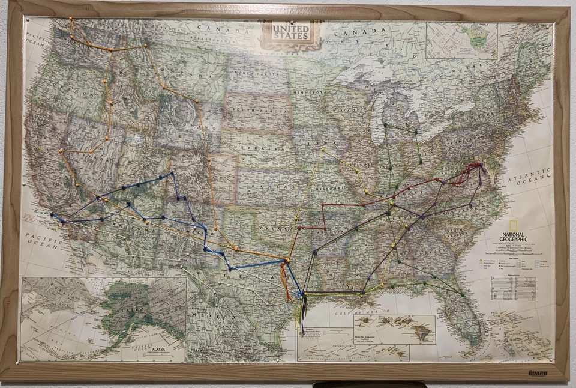

# Memoree Lane Application 📍🗺️

Memoree Lane is like your everyday social media app but with a twist! This app is built for vanlifers and travel addicts. When a post is made, your current location is then logged on the map as a "pin point". The purpose is to visualize the places on a map you've been.

**Think something like this but at your finger tips virtually!**


---

[Server Documentation](https://github.com/cheyroseflammer/memoreeLaneServer)

[Live Site](http://cominsooon.com)

## Starting the Client 🚀

---

Clone repo: `git clone https://github.com/cheyroseflammer/memoreeLaneClient.git`

Install dependencies: `npm install`

Run unit tests: `npm test`

Start client: `npm start`

## User Stories 👤

✅ Done

- Add a new post - High Priority 🔴
- See my post location pin on map - High Priority 🔴
- Edit a post - High Priority 🔴
- Delete a post - High Priority 🔴
- Like a post - Medium Priority 🟠

🟨 In Progress

- Sign Up + Google 0Auth Authentication - Medium Priority 🟠
- Login with Email JWT - Medium Priority 🟠
- Sign Out - Medium Priority 🟡
- Comment on a post - Low Priority 🟡
- Post Pagination - Low Priority 🟡
- Post Search Functionality - Low Priority 🟡

## Data Fetching 🌐

---

**Fetching data using Redux Actions** ⬇️:

```
export const getPosts = () => async (dispatch) => {
    const { data } = await api.fetchPosts();
    dispatch({ type: 'FETCH_ALL', payload: data.data });
};
```

**Posting data using Redux Actions** ⬆️:

```
  export const createPost = (post) => async (dispatch) => {
    const { data } = await api.createPost(post);
    dispatch({ type: 'CREATE', payload: data });
};
```
